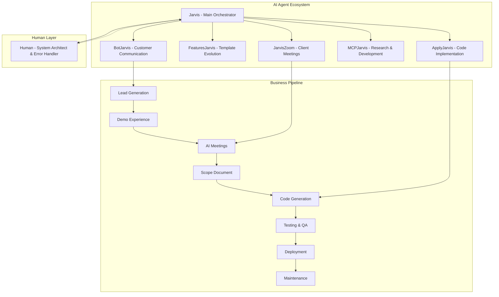

# 🚀 AI-Powered Software Agency - The Complete Vision

**Transforming software development through AI orchestration: From template-driven MVP to fully automated enterprise monopoly**

[](LICENSE)
[](README.md)
[](README.md)

---

## 🎯 **Project Mission**

Create a **self-sustaining AI ecosystem** that transforms a single developer into an automated software empire. Starting with template-driven CRM/ERP solutions, evolving into a comprehensive AI-powered development agency that handles everything from client acquisition to code delivery - with minimal human intervention.

### **Core Philosophy**

> "Build the system once, let AI scale it infinitely"

We're not just building software - we're building **the system that builds software**, where documented patterns become AI training data, and every client interaction teaches our agents to be better.

---

## 🏗️ **System Architecture Overview**

### **The AI Hierarchy**



### **Template Foundation**

Built on the **Terraform Deploy** and **CRM Template** infrastructure:

- **Multi-cloud deployment** (AWS, Azure, GCP via Terraform)
- **Role-based access control** for industry-specific needs
- **Multi-language support** (English, Spanish, expandable)
- **Enterprise-grade observability** (Prometheus, Grafana)
- **Containerized deployment** with auto-scaling
- **3-minute production deployments**

---

## 🎨 **The Revolutionary Demo Experience**

### **Adaptive Brand Integration**

When a potential client visits our demo:

1. **Email Collection** - Visitor provides business email
2. **Company Intelligence** - AI extracts company domain and researches web presence
3. **Brand Color Extraction** - Specialized AI model analyzes company website for color patterns
4. **Real-time Customization** - Demo instantly rebrands to match client's visual identity
5. **Tiered Tutorial Experience** - Progressive feature demonstration

### **Tutorial Progression System**

```
🟢 BASIC Tier ($50k MXN)
├── Standard CRUD operations
├── Basic role management
├── Single language (Spanish/English)
├── Essential reporting
└── Standard deployment

🟡 INTERMEDIATE Tier ($100k MXN)
├── Multi-language translation system
├── Email integration & notifications
├── Database-driven notifications
├── Enhanced dashboard analytics
├── Basic observability metrics
└── Advanced role hierarchies

🟠 PREMIUM Tier ($300k MXN)
├── Advanced observability (Grafana dashboards)
├── In-app messaging system
├── 3+ language support
├── Real-time collaboration tools
├── Custom reporting engine
├── API integrations
└── Mobile-responsive design

🔴 ENTERPRISE Tier ($400k+ MXN)
├── Custom feature development
├── Advanced AI integrations
├── Multi-tenant architecture
├── Enterprise SSO
├── Custom integrations
├── Dedicated support
├── SLA guarantees
└── Industry-specific modules
```

---

## 🤖 **AI Agent Detailed Specifications**

### **Jarvis (Main Orchestrator)**

- **Role**: System conductor and human interface
- **Capabilities**:
  - Coordinates all other agents
  - Direct communication with human operator
  - Emergency escalation protocols
  - Performance monitoring of sub-agents
  - Strategic decision making
- **Communication**: Can call human operator, manage dual-Claude discussions for complex decisions

### **JarvisZoom (Meeting Specialist)**

- **Role**: Client interaction and voice synthesis
- **Capabilities**:
  - AI voice synthesis matching human operator
  - Automated scope document generation
  - Contract template customization
  - Meeting scheduling integration
  - Fallback to human for technical issues
- **Monitoring**: Real-time connection monitoring with instant human escalation

### **FeaturesJarvis (Innovation Engine)**

- **Role**: Template evolution and new capability development
- **Capabilities**:
  - Market trend analysis
  - Feature gap identification
  - Template enhancement proposals
  - Technology integration research
  - Competitive analysis

### **ApplyJarvis (Implementation Specialist)**

- **Role**: Pattern-following code generation
- **Capabilities**:
  - Scope document interpretation
  - Template customization
  - Code quality assurance
  - Testing implementation
  - Deployment coordination

### **MCPJarvis (Research Coordinator)**

- **Role**: Managing investigation teams for MCP improvements
- **Capabilities**:
  - Research task distribution
  - Knowledge base expansion
  - Tool development coordination
  - Documentation maintenance

### **BotJarvis (Communication Manager)**

- **Role**: Customer interaction and reporting
- **Capabilities**:
  - Lead qualification
  - 24/7 customer support
  - Daily progress reports
  - Client satisfaction monitoring
  - Multi-platform messaging

---

## 💰 **Business Model & Revenue Strategy**

### **Primary Revenue Streams**

#### **Template Deployment Services**

- **Basic**: $50k MXN - Standard CRM/ERP with essential features
- **Intermediate**: $100k MXN - Enhanced features with integrations
- **Premium**: $300k MXN - Advanced observability and custom features
- **Enterprise**: $400k+ MXN - Fully custom solutions

#### **Maintenance & Support Contracts**

- Monthly maintenance: 10-15% of initial project cost
- Feature updates and security patches
- Performance optimization
- Technical support

#### **Template Licensing**

- White-label licensing to other agencies
- Developer access to template library
- Training and certification programs

#### **Vertical Expansion**

- Industry-specific templates (Chemical, Logistics, Financial, etc.)
- Specialized demo environments
- Custom AI agents for specific industries

### **Revenue Multiplication Strategy**

```
Year 1: Template Services (Direct delivery)
├── Goal: $500k MXN revenue
├── 10-15 client projects
└── Foundation for automation

Year 2: AI-Assisted Operations
├── Goal: $2M MXN revenue
├── 50+ client projects with 70% automation
└── Template licensing launch

Year 3: Full Automation + Expansion
├── Goal: $10M MXN revenue
├── 200+ projects with 90% automation
├── Multiple industry verticals
└── International expansion

Year 4-5: Technology Monopoly
├── Goal: $50M+ MXN revenue
├── AI model development
├── Platform-as-a-Service offerings
└── Acquisition of competitors
```

---

## 🔧 **Technical Infrastructure**

### **Development Stack**

#### **Frontend Technology**

- **Next.js 15** with App Router and TypeScript
- **shadcn/ui** component library (MIT licensed)
- **Tailwind CSS** for styling
- **Clerk** for authentication with role-based access
- **next-intl** for internationalization

#### **Backend Infrastructure**

- **PostgreSQL** with DrizzleORM
- **Node.js** API routes
- **Docker** containerization
- **Multi-cloud Terraform** (AWS, Azure, GCP)

#### **AI Integration**

- **Claude Sonnet 4** for primary AI agents
- **Custom MCP servers** for pattern recognition
- **Voice synthesis** for client interactions
- **Computer vision** for brand color extraction

#### **Observability & Monitoring**

- **Prometheus** metrics collection
- **Grafana** dashboards
- **CloudWatch/Azure Monitor** cloud metrics
- **Custom performance tracking** for AI agents

### **Quality Assurance Pipeline**

#### **Automated Testing**

```typescript
interface TestingPipeline {
  visualTesting: PlaywrightSnapshots;
  functionalTesting: VitestUnitTests;
  integrationTesting: EndToEndScenarios;
  aiQualityGates: PatternComplianceChecks;
  performanceTesting: LoadTestingScenarios;
}
```

#### **AI-Driven QA Process**

1. **Design Validation**: AI PM reviews against client brand guidelines
2. **Code Quality**: Automated pattern compliance checking
3. **Visual Regression**: Playwright snapshot comparisons
4. **Functional Testing**: Automated user journey validation
5. **Performance Benchmarks**: Response time and scalability tests

---

## 📋 **Short-Term Implementation Roadmap**

### **Foundation Phase**

#### **Template Completion & Documentation**

- [ ] Complete CRM Template with all chemical industry features
- [ ] Document all coding patterns and conventions for AI training
- [ ] Create comprehensive style guide and component library
- [ ] Establish testing patterns and quality gates
- [ ] Build deployment automation scripts

#### **Legal & Business Setup**

- [ ] Verify MIT license compliance and create proper attribution
- [ ] Develop contract templates with legal consultation
- [ ] Create service level agreements for different tiers
- [ ] Establish business entity and tax structure
- [ ] Set up professional insurance and liability protection

#### **AI Foundation Layer**

- [ ] Create custom MCP server with established patterns
- [ ] Configure Claude Code personality for pattern following
- [ ] Set up two-layer AI system (PM + Developer)
- [ ] Test AI code generation quality against existing templates
- [ ] Create feedback loops for AI improvement

#### **Initial Market Validation**

- [ ] Create compelling portfolio with screen recordings
- [ ] Develop before/after client showcase materials
- [ ] Build freelance platform presence with professional profile
- [ ] Launch with intermediate pricing (25k MXN) for market testing
- [ ] Target 3-5 initial clients for validation and testimonials

#### **Client Delivery System**

- [ ] Establish project management workflow
- [ ] Create client communication templates
- [ ] Set up progress tracking and reporting systems
- [ ] Develop handoff procedures and documentation
- [ ] Build maintenance and support processes

### **AI Integration Phase**

#### **BotJarvis Development**

- [ ] Build lead qualification system
- [ ] Create automated response templates
- [ ] Set up multi-platform messaging integration
- [ ] Implement basic customer support capabilities
- [ ] Establish escalation procedures to human operator

#### **Demo System Creation**

- [ ] Build email collection and company research pipeline
- [ ] Develop brand color extraction AI model
- [ ] Create real-time demo customization system
- [ ] Implement tiered tutorial progression
- [ ] Set up analytics and conversion tracking

#### **JarvisZoom Foundation**

- [ ] Research voice synthesis technology for Spanish/English
- [ ] Create meeting scheduling integration
- [ ] Develop scope document generation templates
- [ ] Build contract customization system
- [ ] Test AI meeting capabilities with controlled scenarios

#### **Quality Assurance Automation**

- [ ] Set up Playwright visual testing pipeline
- [ ] Create automated code review system
- [ ] Implement pattern compliance checking
- [ ] Build performance benchmarking tools
- [ ] Establish continuous integration/deployment

### **Business Scaling Phase**

#### **Price Optimization & Market Expansion**

- [ ] Gradually increase pricing based on market response
- [ ] Develop case studies and success stories
- [ ] Create referral and testimonial programs
- [ ] Expand to additional freelance platforms
- [ ] Build direct marketing website

#### **Template Evolution**

- [ ] Add Azure and GCP deployment options
- [ ] Integrate advanced observability features
- [ ] Develop industry-specific customizations
- [ ] Create mobile-responsive enhancements
- [ ] Build API integration capabilities

#### **AI Agent Enhancement**

- [ ] Improve ApplyJarvis code generation accuracy
- [ ] Expand FeaturesJarvis market analysis capabilities
- [ ] Enhance MCPJarvis research coordination
- [ ] Optimize Jarvis main orchestration logic
- [ ] Implement dual-Claude discussion system

#### **Operational Excellence**

- [ ] Create comprehensive monitoring dashboards
- [ ] Establish performance metrics and KPIs
- [ ] Build automated reporting systems
- [ ] Develop error handling and recovery procedures
- [ ] Implement security and compliance measures

---

## 🌟 **Long-Term Vision & Strategic Goals**

### **Phase 1: Market Domination (Year 1-2)**

#### **Template Monopoly Establishment**

- **Multi-Cloud Supremacy**: Terraform templates for AWS, Azure, GCP, and emerging providers
- **Industry Vertical Expansion**: Specialized templates for 10+ industries (Chemical, Logistics, Healthcare, Financial, Manufacturing, Retail, etc.)
- **Technology Integration**: AI translation, advanced messaging, comprehensive observability
- **Geographic Expansion**: Templates optimized for Latin American, North American, and European markets

#### **AI Agent Ecosystem Maturation**

- **Full Automation**: 90%+ of client interactions handled by AI agents
- **Predictive Capabilities**: AI agents that anticipate client needs and suggest solutions
- **Learning Acceleration**: Each client interaction improves all future interactions
- **Quality Assurance**: Zero-defect deployment through AI-driven testing

### **Phase 2: Platform Evolution (Year 2-3)**

#### **Technology Platform Development**

- **SaaS Transformation**: Convert templates into subscription-based platform
- **White-Label Solutions**: Partner program for agencies and consultants
- **Developer Marketplace**: Third-party integrations and extensions
- **AI Model Development**: Proprietary models for specific business functions

#### **Advanced AI Capabilities**

- **Predictive Analytics**: Business intelligence and forecasting for clients
- **Automated Optimization**: Self-improving applications that enhance performance
- **Natural Language Interfaces**: Clients can request features in plain language
- **Autonomous Updates**: AI agents that maintain and upgrade client systems

### **Phase 3: Market Expansion (Year 3-4)**

#### **Horizontal Integration**

- **Mobile Application Development**: AI-generated mobile apps for all templates
- **Custom AI Model Training**: Industry-specific AI models as a service
- **Business Process Automation**: Beyond software into complete business workflows
- **Integration Ecosystem**: Connections with major business platforms (Salesforce, SAP, etc.)

#### **Strategic Partnerships**

- **Cloud Provider Partnerships**: Preferred partner status with major providers
- **Technology Integrations**: Deep partnerships with complementary technologies
- **Educational Programs**: Training and certification for developers
- **Industry Associations**: Thought leadership in AI-driven development

### **Phase 4: Technology Monopoly (Year 4-5)**

#### **Comprehensive Business Solutions**

- **End-to-End Automation**: From lead generation to software maintenance
- **Industry Standards**: Our templates become the de facto standard
- **Acquisition Strategy**: Purchase complementary technologies and competitors
- **Global Presence**: Operations in multiple countries and languages

#### **Innovation Leadership**

- **Research & Development**: Advanced AI research lab
- **Patent Portfolio**: Intellectual property protection for key innovations
- **Open Source Contributions**: Strategic open source projects to drive adoption
- **Thought Leadership**: Industry conferences, publications, and standards bodies

### **Phase 5: Legacy & Impact (Year 5+)**

#### **Market Transformation**

- **Industry Disruption**: Traditional software development agencies obsolete
- **Educational Impact**: New paradigms in software engineering education
- **Economic Impact**: Job creation in AI oversight and creative problem solving
- **Technology Transfer**: Licensing core technologies to other industries

#### **Sustainable Growth**

- **Environmental Responsibility**: Green cloud computing and efficient resource usage
- **Social Impact**: Democratizing access to enterprise-grade software
- **Knowledge Sharing**: Open research and development practices
- **Mentorship Programs**: Training the next generation of AI-augmented developers

---

## 📊 **Success Metrics & KPIs**

### **Business Performance Indicators**

#### **Revenue Metrics**

- Monthly Recurring Revenue (MRR) growth rate
- Average Revenue Per Customer (ARPC)
- Customer Lifetime Value (CLV)
- Revenue per AI agent interaction
- Geographic revenue distribution

#### **Operational Efficiency**

- Time from lead to delivered product
- AI automation percentage across all processes
- Customer satisfaction scores (NPS)
- Template deployment success rate
- Support ticket resolution time

#### **Market Position**

- Market share in target industries
- Brand recognition and awareness metrics
- Competitive win rate
- Customer retention and churn rates
- Referral and testimonial generation

### **Technical Performance Indicators**

#### **AI Agent Performance**

- Code generation accuracy rates
- Client meeting success rates
- Scope document approval rates
- Automated testing pass rates
- System uptime and reliability

#### **Template Quality Metrics**

- Deployment success rate
- Performance benchmarks
- Security vulnerability assessments
- User experience metrics
- Maintenance requirements

#### **Innovation Metrics**

- New feature development velocity
- Technology integration success
- Patent applications and approvals
- Research publication impact
- Industry standard contributions

---

## 🔄 **Continuous Learning & Adaptation**

### **Data-Driven Improvement**

#### **Client Interaction Analysis**

Every client interaction becomes training data:

- Meeting transcripts for JarvisZoom improvement
- Scope document iterations for pattern recognition
- Code review feedback for ApplyJarvis enhancement
- Support ticket analysis for BotJarvis optimization

#### **Performance Optimization**

- A/B testing for demo conversion rates
- Template performance benchmarking
- AI agent efficiency measurements
- Cost optimization across cloud providers

#### **Market Intelligence**

- Competitive analysis and response strategies
- Technology trend identification and adoption
- Client need prediction and solution development
- Industry regulation and compliance monitoring

### **Risk Management & Mitigation**

#### **Technology Risks**

- AI model degradation monitoring
- Dependency vulnerability assessment
- Cloud provider diversification
- Backup and disaster recovery procedures

#### **Business Risks**

- Market saturation contingency planning
- Competitive threat response strategies
- Regulatory compliance maintenance
- Financial risk diversification

#### **Operational Risks**

- Key personnel dependency reduction
- Process documentation and standardization
- Quality assurance redundancy
- Customer relationship protection

---

## 🎯 **Call to Action**

This document represents more than a business plan - it's a blueprint for transforming the software development industry through AI orchestration. Every template we build, every client we serve, and every AI interaction we document brings us closer to a future where software development is democratized, efficient, and accessible to businesses of all sizes.

The journey from a single developer with a vision to an AI-powered technology monopoly begins with the first line of code and the first satisfied client. Every pattern we document today becomes the foundation for tomorrow's automated solutions.

**The future of software development is not about replacing humans - it's about amplifying human creativity through intelligent systems.**

---

## 📞 **Contact & Collaboration**

**Project Lead**: Development Team  
**Email**: [contact@example.com](mailto:contact@example.com)  
**Vision Status**: Foundation Phase - Active Development  
**Next Milestone**: Template MVP Completion & Market Validation

---

_Built with 🤖 AI orchestration and ❤️ human vision_

---

**License**: This README and associated documentation are proprietary. The underlying template technology utilizes MIT-licensed components where appropriately attributed.
